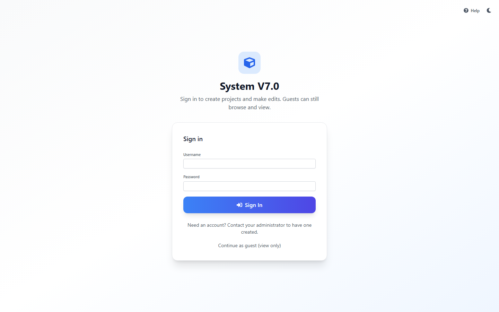
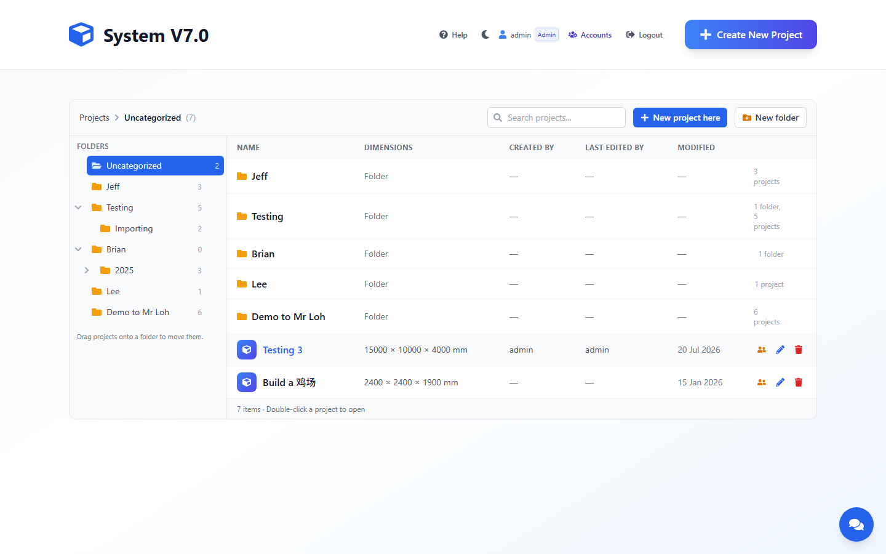
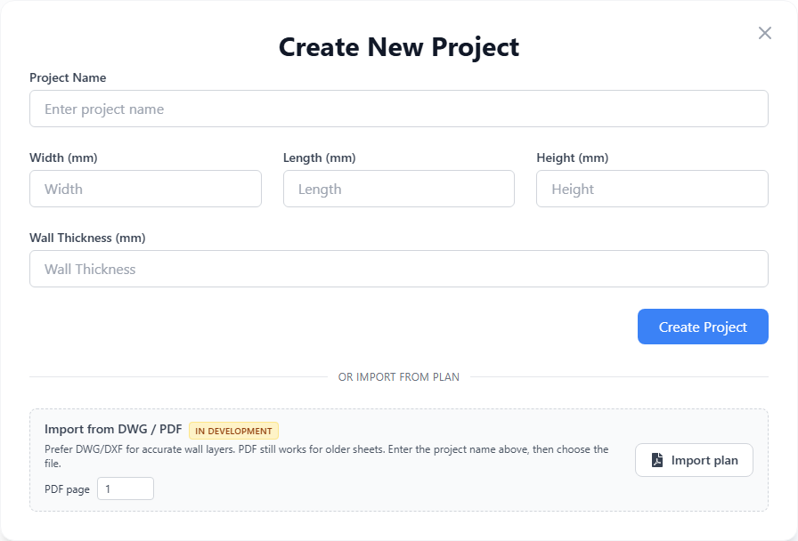
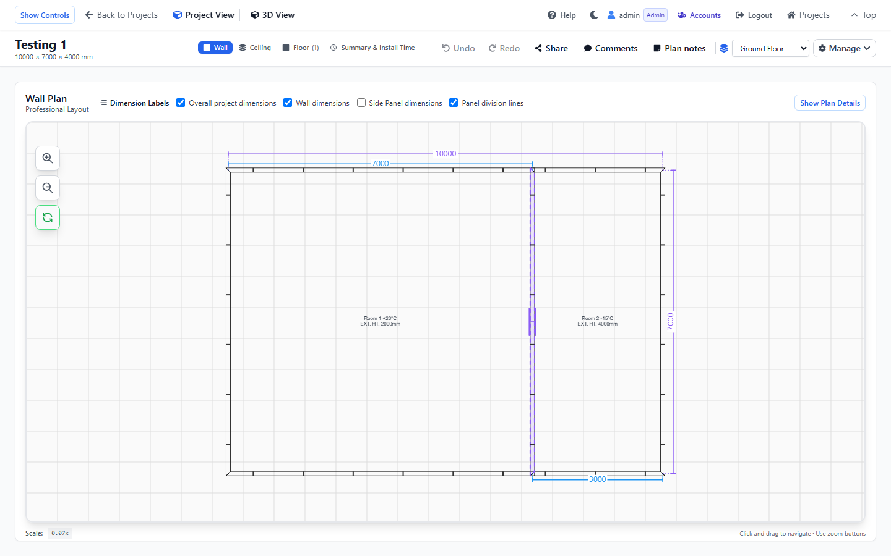
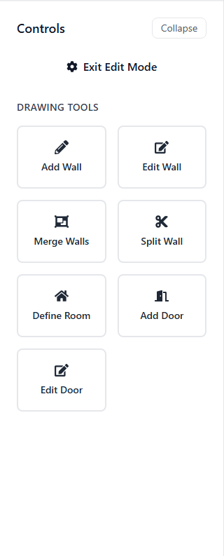
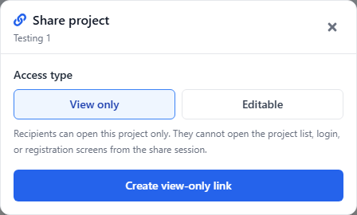
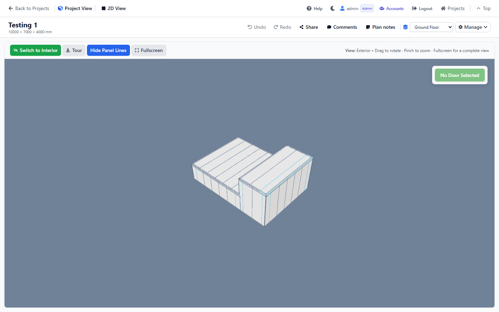
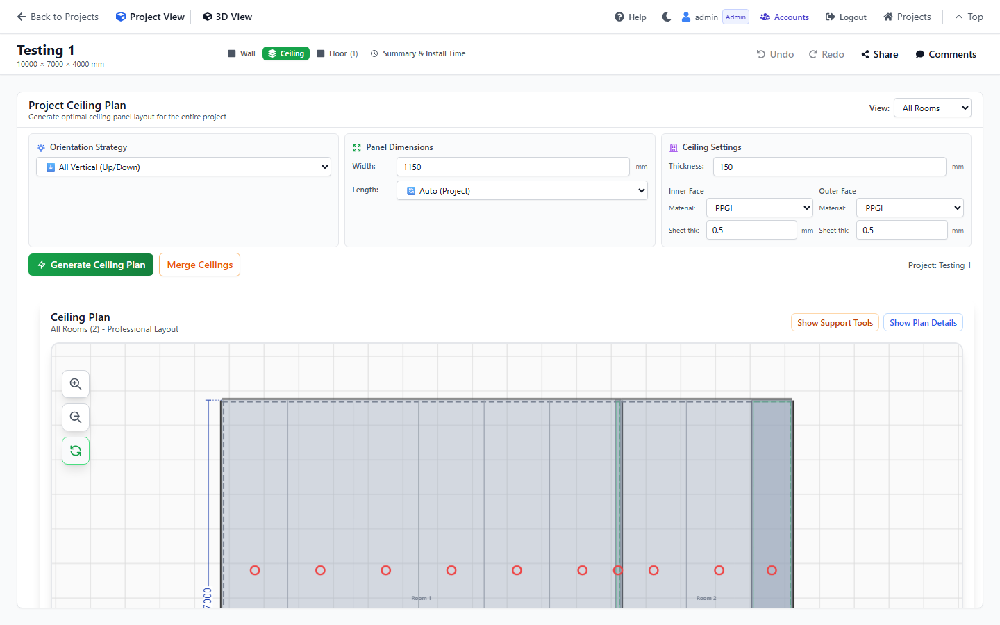
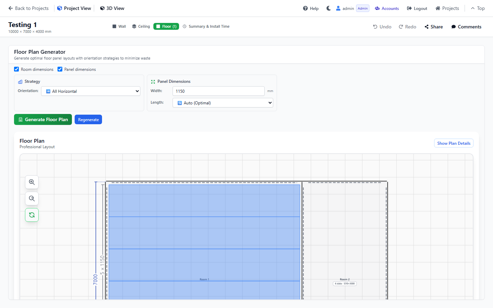
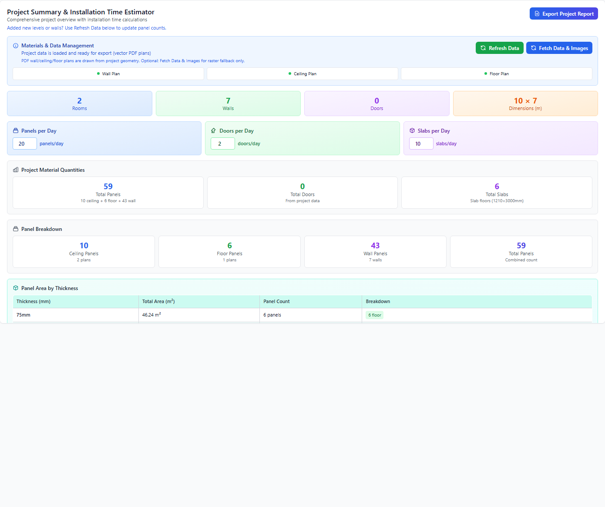

# United Panel System V7.0 — User Manual

This manual describes every screen, drawing tool, and control in the system. All sizes are in millimetres (mm) unless a field says otherwise.

Open **Help** in the top bar. In-app Help shows only the screens and buttons for the account you are signed in as (**Admin**, **Drafter**, or **Salesman**). Other roles’ tools are not listed.

---

## What each account sees

| | **Admin** | **Drafter** | **Salesman** |
|---|---|---|---|
| Home | All projects. Create, folders, chat, visibility, edit, delete. | Same as Admin. | Banner *View-only access (Salesman)*. Assigned projects only. No create, rename, or delete. |
| Draw walls / rooms / doors / **wall joints** / levels | **Enter Edit Mode**, **Configure Joints**, all drawing tools. | Same as Admin. | Hidden. Controls show *View-only mode*. |
| Ceiling / Floor generate, **ceiling joints**, supports | Yes (AA11 / Cut L / Cut 45). | Yes | View generated plans. Ceiling **Joint Configuration** is read-only. |
| Wall panel calculation | Yes | Yes | Hidden. |
| **Comments** / **Feedback** | **Comments** (review salesman notes). | **Comments**. | **Feedback** (add notes; optionally select walls). |
| **Share**, **Plan notes**, **Undo** / **Redo** | Yes | Yes | Hidden. |
| **Versions** | Save, view, compare, restore, delete. Open shows original. | Same | View and compare snapshots only. |
| **Accounts** (create users) | Yes | Hidden | Hidden. |
| Summary, export, 3D / Tour | Yes | Yes | Yes. |

**Admin.** Full editing plus **Accounts** to create Drafter and Salesman users.

**Drafter.** Same drawing, generate, export, and Comments as Admin. Cannot open Accounts.

**Salesman.** Review assigned projects, leave Feedback, walk 3D, and export. Cannot draw or generate. If a project is missing, ask an Admin or Drafter to tick your account in **Salesman visibility**.

---

## Contents

1. [Introduction](#1-introduction)
2. [Sign in, roles, and chrome](#2-sign-in-roles-and-chrome)
3. [Home, folders, and projects](#3-home-folders-and-projects)
4. [Creating a project](#4-creating-a-project)
5. [Chat assistant](#5-chat-assistant)
6. [Project workspace](#6-project-workspace)
7. [Wall plan — drawing tools](#7-wall-plan--drawing-tools)
8. [Rooms](#8-rooms)
9. [Doors and windows](#9-doors-and-windows)
10. [Levels (storeys)](#10-levels-storeys)
11. [Plan notes, comments, versions, and sharing](#11-plan-notes-comments-versions-and-sharing)
12. [3D view and walkthrough tour](#12-3d-view-and-walkthrough-tour)
13. [Ceiling plan](#13-ceiling-plan)
14. [Floor plan](#14-floor-plan)
15. [Wall panel calculation](#15-wall-panel-calculation)
16. [Summary, installation time, and export](#16-summary-installation-time-and-export)
17. [Keyboard shortcuts and mouse / touch](#17-keyboard-shortcuts-and-mouse--touch)
18. [Typical workflows](#18-typical-workflows)
19. [Tips and troubleshooting](#19-tips-and-troubleshooting)

See also: [What each account sees](#what-each-account-sees) at the top of this file.

---

## 1. Introduction

System V7.0 is a cold-store / insulated-panel design tool. You draw a wall plan, define rooms, place doors and windows, generate ceiling and floor panels, review a 3D model, estimate installation time, and export a project report.

**Typical order of work (Admin / Drafter)**

1. Create or import a project.
2. Draw walls on the **Wall** tab (edit mode).
3. Define rooms, then add doors and windows.
4. Add extra storeys if the building has more than one level.
5. Generate the **Ceiling** and **Floor** plans.
6. Calculate wall panels and review **Summary & Install Time**.
7. Walk the **3D View**, then share or export.

**Typical order of work (Salesman)**

1. Open Home. You only see assigned projects.
2. Click a project row.
3. Review Wall, Ceiling, and Floor (zoom and pan).
4. Open **3D View** and **Tour**.
5. Click **Feedback**. Optionally **Select walls on plan**, then **Add comment**.

**Units.** Coordinates, wall sizes, panel sizes, and elevations are millimetres. Room temperature is in °C. Installation rates are panels / doors / slabs per day.

---

## 2. Sign in, roles, and chrome

### 2.1 Login

*Sign In, guest link, Help, and theme toggle.*

| Control | What it does |
|---|---|
| **Username** / **Password** | Sign in with an account created by an administrator. |
| **Sign In** | Opens the project list. |
| **Continue as guest (view only)** | Does not open Home. Use a share link to browse one project without signing in, or **Sign In** for the project list. |
| **Back to shared project (view only)** | Returns to a shared project without signing in. |
| Theme (sun / moon) | Light or dark mode. Also available on every signed-in screen. |

Need an account? Contact an administrator. There is no public registration.

### 2.2 Roles

| Role | Can draw / edit | Comments | Other |
|---|---|---|---|
| **Admin** | Yes | Views **Comments** | **Accounts** — create, edit, and remove users |
| **Drafter** | Yes | Views **Comments** | Full project editing |
| **Salesman** | No | Posts **Feedback** | Sees only projects assigned to them |
| Guest / view-only share | No | No | Browse 2D / 3D; cannot change the model |

### 2.3 Top-bar chrome (every signed-in page)

| Control | What it does |
|---|---|
| **Help** | Opens this manual. Topics and buttons match your signed-in role (Admin, Drafter, or Salesman). |
| Theme toggle | **Switch to dark mode** / **Switch to light mode**. |
| Username + role badge | Who you are signed in as. |
| **Accounts** | Admin only. Manage usernames, roles, and passwords. |
| **Logout** | Sign out. |
| **Login** | Shown to guests. |

**Accounts** modal (Admin): tabs **Accounts (N)** and **Add account**; filters **All** / Admin / Drafter / Salesman; edit username, role, password; remove accounts. **Add account** creates **Drafter** or **Salesman** only (password minimum 6 characters). You cannot create another Admin here.

---

## 3. Home, folders, and projects

Home is titled **System V7.0**.

*Folders on the left, project table on the right. Search is on every signed-in account. Create, folders, and visibility are Admin / Drafter only.*

### 3.1 Admin / Drafter

You see **Create New Project**, **New folder**, the chat assistant, visibility, pencil, and trash.

| Control | What it does |
|---|---|
| Breadcrumb **Projects** | Go to the top of the folder tree. Click any crumb to jump there. |
| **Search projects...** | Filter by name, folder, or dimensions. **Clear search** (×) resets. |
| **New project here** / **New** | Create a project in the current folder. |
| **New folder** / **New subfolder** | Create a folder at the current level, or inside the selected folder. |
| Folder chevron | Expand or collapse children. |
| Folder **⋯** | **New subfolder**, **Rename**, **Delete**. |
| Table columns | **Name**, **Folder** (while searching), **Dimensions**, **Created by**, **Last edited by**, **Modified**. |
| Click a project row | Open the workspace. |
| Visibility (people icon) | **Salesman visibility** — choose which salesman accounts can see this project. |
| Pencil | **Edit project** (name and site size). |
| Trash | **Delete project**. |
| Unread comment badge | Number of unread comments / feedback items. |

Special folder: **Uncategorized**. Empty states: *No projects match your search*, *This folder is empty*, *No projects here yet*.

**Delete a project:** row **Trash** (**Delete project**) → confirm in the dialog, or **Cancel**. Success: *Project deleted successfully!*

**Delete a folder:** folder **⋯** → **Delete**. Confirm: *Delete this folder and all subfolders? Projects inside will move to Uncategorized.* → **Delete Folder** or **Cancel**.

### 3.2 Salesman

Banner: **View-only access (Salesman). You only see projects assigned to your account, and cannot create or edit.**

| Control | What it does |
|---|---|
| Breadcrumb **Projects** | Jump folders you can see. |
| **Search projects...** | Filter assigned projects. |
| Folder chevron | Expand or collapse children. |
| Click a project row / **Open** | Open the project in view-only mode. |
| Unread badge | Unread Feedback items. |

**New project here**, **New folder**, folder **⋯**, pencil, trash, visibility, **Create New Project**, and chat are hidden. If a project is missing, ask an Admin or Drafter to tick your account in **Salesman visibility**.

### 3.3 Create folder (Admin / Drafter)

**Create folder** / **Create subfolder** → **Folder name** → **Cancel** or **Create folder**.

### 3.4 Edit project (Admin / Drafter)

**Edit Project**: **Project Name**, **Width (mm)**, **Length (mm)**, **Height (mm)** → **Cancel** / **Update Project**. Wall thickness is set at create time, not here.

### 3.5 Salesman visibility (Admin / Drafter)

**Salesman visibility**: search **Search salesman accounts...**; lists **Can view this project** and **Not assigned**; **Cancel** / **Save**. This is how a Salesman gets access to a project.

---

## 4. Creating a project

### 4.1 Blank project

*Project Name, Width / Length / Height (mm), Wall Thickness (mm), Create Project. Import from DWG / PDF is below.*

| Field | Notes |
|---|---|
| **Project Name** | Required. |
| **Width (mm)** / **Length (mm)** / **Height (mm)** | Site envelope used for overall dimensions and 3D framing. |
| **Wall Thickness (mm)** | Default thickness for new walls. |
| **Create Project** | Creates the project, then **Choose a folder** if folders exist. |
| **Choose a folder** | Pick a folder, **Create a new folder**, or skip. |

If you started from a folder, a banner shows *This project will be added to **{folder}***.

### 4.2 Import from DWG / PDF

On the create form: **or import from plan** → **Import from DWG / PDF**. Prefer DWG / DXF. Choose **PDF page** (1-based) if needed → **Import plan**.

From an existing project, **Import plan from PDF / DWG** reviews detected walls, doors, rooms, joints, height, and thickness, then **Import into project**.

Imported geometry is a starting point. Check snap, wall type, and room outlines before generating panels. The **Import from DWG / PDF** block may show an **In development** badge — the button still runs **Import plan**.

---

## 5. Chat assistant

Editors see a blue chat button on the home page (lower right). Title: **Open chat assistant to create a project**.

**If you have never used it**

1. Click the chat button.
2. Tap **I’m new — guide me**.
3. Answer one question at a time. You can tap a suggestion chip instead of typing.
4. When the summary appears, tap **Create project** (or type **create**).

You can also paste the whole job in one message. Tap **Show an example** for a template. Type **restart** to start over.

**What it can ask**

Folder: **place it** in an existing folder, **create a new folder**, or leave it uncategorized. Then project name, site size, and rooms. For each room, one reply can include size, height, temperature, and floor. If you only send a size, it uses project height, 0°C, slab 100 mm, ceiling yes, and PPGI walls. Wall thickness defaults to 100 mm.

**Examples**

- *I’m new — guide me*
- *Show an example*
- *Help me create a project*
- *Create new folder*
- *new folder Cold Stores*
- *Create project Alpha in Testing, site 5000 × 8500 × 6000, walls 100*

| You can say | Meaning |
|---|---|
| `5000 × 8500 × 6000` | Width × length × height in mm. `5m × 8.5m × 6m` is metres. Small numbers without a unit are metres. |
| `yes` / `no` | Include rooms or skip. |
| `2 to 6` | Temperature range in °C. `ambient` → 0 °C. |
| `same as previous` | Copy remaining details from the last room. |
| `Slab` / `Panel` / `None` | Floor type. Add a number for thickness, e.g. `slab 100`. |
| `uncategorized` | No folder. |
| `Create new folder` / `new folder Cold Stores` | Make a new folder, then put the project there. |

The assistant packs rooms so they share walls. It does **not** create ceiling joints. Set joints on the Ceiling tab after generation.

---

## 6. Project workspace

Open a project to reach the workspace. Header shows the project name and `W × L × H mm`.

*Wall tab with the plan canvas, dimension checkboxes, zoom, and Controls sidebar.*

### 6.1 Navigation

| Control | What it does |
|---|---|
| **Back to Projects** / **Projects** | Return home (hidden on a share link). |
| **Show Controls** | Restore the left sidebar if it was collapsed. |
| Controls menu (mobile) | **Toggle controls menu** — opens the drawing sidebar. |
| **2D View** / **3D View** | Switch between plan and 3D. |
| **Top** | Scroll to the top of the page. |
| **Project View** / **Shared Project** | Context label. |

### 6.2 Plan tabs (2D)

| Tab | When it is available |
|---|---|
| **Wall** | Always. |
| **Ceiling** | After at least one room exists. |
| **Floor** | After rooms exist. May show `(N)` for panel-floor rooms. |
| **Summary & Install Time** | Hidden on view-only share links. |

Ceiling and Floor stay disabled until you define rooms.

### 6.3 Header actions (Admin / Drafter)

| Control | Shortcut / note |
|---|---|
| **Undo** | Ctrl+Z |
| **Redo** | Ctrl+Y |
| **Versions** | Save, view, compare, restore, or delete a snapshot. Opening a project always shows the original (version 0). |
| **Share** | Create a view-only or editable link. Not shown inside a share session. |
| **Comments** | Review salesman Feedback. Unread badge. |
| **Plan notes** | Wall tab only. Text boxes on the plan. |
| Level dropdown | Active storey. **No levels** if none exist. |
| **Manage** | **Edit Level**, **Add Level**, **Delete Level**. |
| **Enter Edit Mode** | Shows Drawing Tools. |

### 6.4 Header actions (Salesman)

| Control | Note |
|---|---|
| **Feedback** | Add customer notes. Optionally **Select walls on plan**. |
| **Versions** | Open saved snapshots to view or compare. Cannot save, restore, or delete. |
| Level dropdown | Switch storey to review. Cannot Add / Delete Level. |
| **2D** / **3D** | Same as editors. Tour works. |

Undo, Redo, Share, Plan notes, Manage, and Enter Edit Mode are hidden. **Versions** is available to view snapshots.

### 6.5 Permission banners

You may see view-only, salesman, or share-link banners. Drawing tools stay hidden until you have edit rights (Admin / Drafter, or an editable share after login).

### 6.6 Versions

The original project stays as version 0. Opening a project always shows version 0. **Save version** stores your current drawing as a new snapshot, then opens that snapshot.

1. Click **Versions**.
2. Optionally type a label, for example `Walls complete`, then click **Save version**.
3. The canvas shows the snapshot you just saved. Click **Back to original** to return to version 0. In **History**, click **View** to open another snapshot. Tick 2 to 4 snapshots and click **Compare** to see them side by side (view only). **Restore** (Admin / Drafter) loads that snapshot onto the canvas for editing; version 0 stays. Save version afterwards to keep those edits as the next snapshot. **Delete** (Admin / Drafter) removes that snapshot only.

Comments, share links, salesman visibility, and the project name stay on restore. The last 20 versions are kept. Undo / Redo for this sitting is cleared after restore. Opening or refreshing the project always shows version 0.

---

## 7. Wall plan — drawing tools

All drawing happens on the **Wall** tab in **2D View**. Click **Enter Edit Mode** to show **Drawing Tools**. Click **Exit Edit Mode** when you are done.

*Add Wall, Edit Wall, Merge Walls, Split Wall, Define Room, Add Door, Edit Door.*

**Cancel** on a tool panel, or **Esc**, leaves the current tool.

### 7.1 Zoom and pan (all plan views)

| Control | Desktop | Touch |
|---|---|---|
| **Zoom In** / **Zoom Out** / **Reset Zoom** | Buttons on the canvas. Reset fits the plan in the viewport. | Same buttons. |
| Pan | **Right-click and drag** on the wall plan. Ceiling / floor: **left-drag**. | Swipe sideways, or two-finger pan. Up/down swipe may scroll the page. |
| Mouse wheel | Does **not** zoom the 2D plan (use the buttons). | — |

Hint under the canvas: *Click and drag to navigate · Use zoom buttons*.

### 7.2 Dimension labels (Wall plan)

| Checkbox | Colour | Meaning |
|---|---|---|
| **Overall project dimensions** | Purple | Full site width and length. |
| **Wall dimensions** | Blue | Length of each wall. |
| **Side Panel dimensions** | Orange | Panel-module sizes along a wall. |
| **Panel division lines** | — | Seam lines (also **Show Panel Lines** in 3D). |

Crowded labels may hide rather than sit on the wrong wall. A **Project Dimensions Exceeded** notice appears if drawing runs outside the site envelope.

### 7.3 Add Wall

1. **Enter Edit Mode** → **Add Wall**.
2. Click the start point, then the end point.

| Field | What it does |
|---|---|
| **Cancel** | Leave Add Wall. |
| **Wall Type** | **Wall** (structural) or **Partition**. |
| **Height (mm)** | Wall height. |
| **Thickness (mm)** | Wall thickness. |
| **Deduct new wall thickness from host at free corners** | Shortens the host so the new wall sits flush. |
| **Auto-split walls at intersections** | Cuts existing walls where the new wall crosses them. |
| **Face Finishes** | Inner / Outer **Material** (PPGI, S/Steel, PVC) and **Thickness (mm)**. |

Hint: *Click on the canvas to start drawing. Click again to finish.*

**While drawing**

- Endpoints snap to walls and intersections.
- Horizontal / vertical world snap is about 2°. Parallel / perpendicular to a slanted host tightens with length (about 10° / 5° / 2°).
- **Esc** or **right-click** cancels an unfinished wall.
- A free (unsnapped) end opens **Enter Wall Length**. Type the length in mm.
- Snap badges: **World horizontal (90°)**, **World vertical (90°)**, **Perpendicular to slant (⊥)**, **Along slant (∥)**, **Free angle**.
- Optional: *Typed value is PDF horizontal/vertical span…* when tracing an imported plan.
- **Confirm** applies the length.

Drawing over a taller room on a lower storey warns that base elevation may need a manual check.

### 7.4 Edit Wall

**Edit Wall** → click a wall. Tick **Select Multiple Walls** to click several. **Show Edit Wall Form (N wall(s))** opens the editor.

**Edit Wall** / **Edit N Wall(s)** form:

| Section | Controls |
|---|---|
| **Position & Dimensions** (single wall) | **Start Point** X / Y, **End Point** X / Y, **Wall Length (mm)**. Padlock = **Lock/Unlock Start X** (and Y / End / length). Locked values stay put while you edit the others. |
| **Wall Properties** | **Wall Height (mm)**, **Wall Base Elevation (mm)**, **Wall Thickness (mm)**, **Wall Type**. |
| **Face Finishes** | Inner / Outer material and sheet thickness. Face buttons: **Outer face** / **Inner face**. |
| **Advanced Options** | **Fill Gap Between Rooms** → **Enable Gap-Fill** / **✓ Enabled**. Gap-fill walls cannot host doors. |
| **Windows on Wall** | **Add Window**, then **Edit** / **Delete** on each. Save the wall first if **Add Window** is disabled. |
| Actions | **Remove Wall** (confirm **Delete wall?**), **Save**, **Cancel editing**. |

Multi-select note: *Changes will be applied to all selected walls.*

### 7.5 Wall joints (Configure Joints)

A **joint** is where two walls meet. This is **Admin / Drafter** only (needs **Enter Edit Mode**). Salesmen cannot open this panel; they still see the result in 2D, 3D, and export.

This is **not** the same as Ceiling **Joint Configuration** (AA11 / Cut L / Cut 45) on the Ceiling tab.

1. **Enter Edit Mode**. Turn off Add Wall / Edit Wall / Define Room so clicks hit corners.
2. Click a wall corner. Panel: **Configure Joints**. Subtitle: *N joints selected · click more on plan to add · Ctrl+click to remove*.
3. Set the type, then **Save Changes**. **Cancel** or **×** closes without saving.

| Type | What it does |
|---|---|
| **None** | No special cut. |
| **Butt-in** | One wall butts into the other. Optional **Deduct joining wall thickness** — shortens Wall A by Wall B’s thickness. |
| **45° Cut** | Miter at the corner. |

| Control | What it does |
|---|---|
| Click another corner | Add that joint. |
| **Ctrl+click** (Cmd+click) | Remove a joint from the selection. |
| **Remove** | Drop one joint when several are selected. |
| **Flip Wall Order** | Swap Wall 1 and Wall 2 (plan highlight colours follow). |
| **Apply to all selected joints** | When 2+ joints are selected: pick a type, then **Apply type to all N joints**. |
| **Save Changes** | *Joint types updated!* or *Updated N joints.* |
| **Cancel** / **×** | Close without saving. |

Recalculate wall panels after you change joints.

### 7.6 Merge Walls

**Merge Walls** → click a run of walls that meet end-to-end and share type, height, thickness, and finishes → **Confirm Merge**.

Success: *Walls merged successfully!*

### 7.7 Split Wall

**Split Wall** → click the wall, then either:

- click the split point on the wall, or
- in **Manual Wall Split**, type **Distance from start (mm)** and click **Split at Distance**.

**Clear Selection** drops the current wall. Success: *Wall split completed successfully!*

### 7.8 Show Plan Details (Wall)

| Control | What it does |
|---|---|
| **Show Plan Details** / **Collapse** | Material and elevation side panel. |
| **Wall Finish Legend** | Inner / outer face colours. |
| **View Material Needed** → **Show Material** / **Hide Material** | Panel and leftover summary. |
| **Wall Elevations** → **Generate Elevations** / **Hide Elevations** | Orthographic elevations of the building. |
| **Calculate Wall Panels (Optimized)** or **(Default)** | See [§15](#15-wall-panel-calculation). |

### 7.9 Room labels on the plan

| Action | How |
|---|---|
| Select a room | Click the label. |
| Edit name / height / description | Double-click. **Enter** or click away to save; **Esc** cancels. |
| Move the label | Drag. Disabled while **Define Room** is active. |

Title: *Click to select room, double-click to edit*. Small rooms may show a leader arrow.

---

## 8. Rooms

### 8.1 Define Room

1. **Enter Edit Mode** → **Define Room**.
2. Click corners in order around the room. Points snap to wall ends and intersections.
3. Click the **first point** again to close the loop.
4. Fill in **Create Room** and click **Create room**.

**Right-click** undoes the last point. **Esc** cancels.

Banner: **Define Room** with **Points:** and **Walls:** counts. *Click on the canvas to place points. Close the loop on the first point…*

The form can be **Minimize**d (*Drawing room area…*) then **Restore panel**, **Resume form**, or **Cancel**.

### 8.2 Create / Edit Room form

| Section | Controls |
|---|---|
| **Room outline** | **Points (N)** — expand to see coordinates. **Walls (N)** list. While editing: *Click canvas corners in order around the perimeter, then save — your point order is kept.* |
| **Room name** | e.g. Cold Room 1. |
| **Temperature (°C)** | Single value or range, e.g. `5` or `2 - 6`. |
| **Room height (mm)** | Single value or range (`3000` or `5000-6000`). Values ≤ 50 are treated as metres. |
| **Use minimum wall height (N mm)** | Sets height from the shortest selected wall. |
| **Variable wall heights** | For sloped roofs — room height will not rewrite wall heights. |
| **Base elevation (mm)** | Height of the floor above (or below) the storey datum. Chips: −300, −150, 0, +150, +300. Default is the active level elevation. |
| **Floor → Type** | **Slab**, **Panel**, or **None**. Only **Panel** rooms appear on the Floor tab generator. |
| **Floor → Thickness** | None, or 50–200 mm. |
| **Floor → Layers** | Count of layers; hint shows total thickness. |
| **Notes** | Optional remarks. |
| Footer | **Cancel**, **Delete** (edit only, confirm **Delete room?**), **Create room** / **Save changes**. |

---

## 9. Doors and windows

### 9.1 Add Door / Edit Door (plan)

**Add Door** → click the host wall (gap-fill walls are skipped). **Edit Door** → click an existing door symbol.

The symbol sits on the **interior** (inner face) or **exterior** (outer face). Position is clamped so the full opening stays on the wall.

### 9.2 Door form

Title: **Add New Door** / **Edit Door** (storey name in the subtitle).

| Section | Controls |
|---|---|
| **Door Type & Configuration** | Type: **Swing**, **Slide**, **Dock Door**. Configuration: **Single-Sided** / **Double-Sided**. |
| **Dimensions** | Width, height, thickness (mm). |
| **Position on Wall** | Slider; **From Left to Door Edge (mm)** / distance from the right. |
| Side | Interior or exterior; **Flip Installing Side**. |
| Swing / slide direction | Left or right; **Flip Opening Direction**. Dock doors do not use a swing/slide direction. |
| **Windows on Door** | **Add Window**. Types in the manager: Glass / Panel / Louver. |
| Actions | **Cancel**, **Delete** (confirm *Are you sure you want to delete this door?* → **Yes, Delete**), **Add Door** / **Update Door**. |

In **3D View**, select a door and use **Open Door** / **Close Door**, or **Space**. In the tour, press **E** (or tap **Open door** / **Close door** on mobile).

### 9.3 Windows on a wall

From **Edit Wall** → **Add Window** / **Edit Window**:

| Field | Notes |
|---|---|
| **Window Type** | Glass. |
| **Width (mm)** / **Height (mm)** | Opening size. |
| **Position Along Wall** | Slider plus **Distance from Left/Right (mm)**. |
| **Position Height** | Slider plus **Distance from Bottom/Top (mm)**. |
| Actions | **Cancel**, **Save**. |

---

## 10. Levels (storeys)

The level dropdown on the Wall tab sets which storey you are drawing. Each storey has its own walls, rooms, doors, and panels.

### 10.1 Add Level — Create New Storey wizard

**Manage** → **Add Level**. Three steps:

**Step 1.** **Storey Name** (e.g. First Floor). **Copy Layout From**: None, or an existing storey.

**Step 2.** **Rooms to Copy Walls From** (checkboxes). **Custom Areas** → **Draw Area** / **Drawing...** traces a polygon the same way as Define Room (**storey-area** mode). **Remove** deletes a custom area. Cancel drawing with **Esc** or the cancel control. Minimized: *Drawing storey area…* → **Restore panel**, **Cancel drawing**, **Resume wizard**.

**Step 3.** **Storey Details**: **Name**, **Elevation (mm)**, **Default Height**. **Included Rooms** with **Room Height (mm)**. Custom-area heights.

Footer: **Back**, **Cancel**, **Next**, **Create Storey**.

### 10.2 Edit Level Mode

**Manage** → **Edit Level**. Copy wall outlines from other levels onto the current storey (walls only, no rooms).

1. Switch the level dropdown to the storey that should receive the copied walls.
2. **Manage** → **Edit Level**. The amber **Edit Level Mode** bar opens.
3. Tick rooms on other storeys. Rooms already copied show *Walls already copied to {level}* and cannot be ticked again.
4. For each ticked room, set **Base Elevation (mm)** and **Room Height (mm)** if you need values different from the source.
5. Click **Add Selected Rooms** (**Adding...** while busy).
6. **Clear Selection** unchecks rooms without copying. **Close** or **Manage** → **Exit Edit Level** leaves the mode.

Ground floor cannot be deleted.

### 10.3 Delete Level

**Manage** → **Delete Level**. Confirm: *Delete this level? Rooms, walls, and panels on this storey will be removed.*

---

## 11. Plan notes, comments, versions, and sharing

### 11.1 Plan notes (Wall tab, editors)

Click **Plan notes**.

| Control | What it does |
|---|---|
| Click the plan | Place a default text box. |
| Drag on the plan | Draw a custom-size box. |
| **Add note** | Another note. |
| **Done** | Leave note mode. |
| Note chips | Jump to that note (**Untitled note** if empty). |

On a selected note:

- Drag to move; south-east handle **Resize note box**.
- Double-click, **Enter**, or **F2** to edit. Placeholder: **Type your note...**. Empty: *Click to add text*.
- **Arrow** / **Move arrow** / **Click plan for arrow tip** — leader to a point on the plan; clear the arrow when done.
- **Delete (Del)** or **Backspace** removes the note.
- **Esc** cancels text editing.

### 11.2 Comments / Feedback

Toolbar: **Comments** (Admin / Drafter) or **Feedback** (Salesman). Panel title: **Customer Feedback**.

| Control | Who | What it does |
|---|---|---|
| **Enter customer feedback...** | Salesman | Comment text. |
| **Select walls on plan** | Salesman | Click walls to attach. Banner: *Click walls on the plan to attach…* → **Done selecting**. |
| **Clear walls** / **Clear highlight** | Both | Drop wall highlight. |
| **Add comment** | Salesman | Submit. |
| Click a comment | Editors | Highlight referenced walls. *Viewing walls referenced by a comment*. |
| **Mark as done** / **Reopen** | Editors | Set status **Done** (shows *Marked done by {username}*) or return it to **Open**. |
| **Done selecting** | Salesman | Finish wall picking after **Select walls on plan**. |
| **Close panel** | Both | Hide the panel. Minimized: **Restore panel**, **Back to comments**. |

### 11.3 Share

**Share** → **Share project**.

| Control | What it does |
|---|---|
| **Access type** | **View only** or **Editable**. |
| **Create view-only link** / **Create editable link** | Creates the URL. |
| **Share link** + **Copy** | Copies the link (**Copied** when done). |

View-only links never require login. **Summary & Install Time**, **Back to Projects**, **Share**, **Comments**, and **Accounts** are hidden. **Versions** is available so recipients can open earlier snapshots. Editable links require an Admin or Drafter login to change the model. Shared sessions cannot open the project list.

### 11.4 Versions

**Versions** is on the project header for anyone who can open the project, including share-link viewers.

The original is version 0. Opening a project always shows the original. **Save version** stores the current drawing as a snapshot, then opens that snapshot. Versions do not appear as extra rows on Home.

| Control | What it does |
|---|---|
| Label | Optional, e.g. `Walls complete` or `After salesman feedback`. |
| **Save version** | Stores the current drawing as v1, v2, … then opens that snapshot. Last 20 are kept. |
| **View** | Opens that snapshot in this project. The original is unchanged. A banner offers **Back to original**. |
| **Compare** | Tick 2 to 4 snapshots, then compare wall plans side by side. View only. The live project is unchanged. |
| **Restore** | Loads that snapshot onto the canvas for editing. Version 0 stays. Confirm first. Save version afterwards to keep those edits as the next snapshot. Comments and share links stay. Admin / Drafter only. |
| **Delete** | Removes that snapshot. The original is unchanged. Confirm first. Admin / Drafter only. |

Do not rely on refresh or closing the browser to create a version. Save one at a milestone, or before a big change.

---

## 12. 3D view and walkthrough tour

Click **3D View**.

*Switch to Interior / Exterior, Tour, Hide Panel Lines, Fullscreen.*

### 12.1 Orbit toolbar

| Control | What it does |
|---|---|
| **Switch to Interior** / **Switch to Exterior** | Cutaway (interior) vs full shell. Mobile labels: Interior / Exterior. |
| **Tour** / **Exit Tour** | Walkthrough. Title: *Pick a starting point and walk the model*. |
| **Show Panel Lines** / **Hide Panel Lines** | Wall panel seams. |
| **Fullscreen** / **Exit Fullscreen** | Enlarge the 3D view. **Esc** also exits. |
| **Open Door** / **Close Door** | After you click a door. Disabled caption: **No Door Selected**. **Space** toggles the selected door. |

Status: *Drag to rotate · Pinch to zoom · Fullscreen…*

### 12.2 Orbit controls (not in tour)

| Input | Action |
|---|---|
| Left drag | Rotate. |
| Middle drag or mouse wheel | Dolly zoom (limited range). Wheel over the canvas may scroll the page instead. |
| Right drag | Pan. |
| One finger | Rotate. |
| Two fingers | Pinch zoom and pan. |

Hover a door for a pointer cursor, then click to select.

### 12.3 Start a tour

1. Click **Tour**.
2. Click the floor where you want to start. HUD: *Choose start — Click the floor to pick where your tour begins · Esc cancel*.
3. **Start tour** or **Enter**. Click elsewhere to move the start point. Blocked spots: *That spot is blocked. Click another point on the floor.*

### 12.4 Desktop tour (pointer lock)

Click the model to capture the mouse. HUD: **Tour** — WASD move · Space up · Left Alt down · Shift sprint · E door · Mouse look · Scroll zoom · Esc exit.

| Key | Action |
|---|---|
| **W A S D** or arrow keys | Walk. |
| **Shift** | Sprint. |
| **Space** | Fly up. |
| **Left Alt** | Fly down. |
| **E** | Open or close the door you are facing. Prompt: **Open door (E)** / **Close door (E)**. |
| Mouse | Look around (pitch is clamped). |
| Scroll | Field-of-view zoom. |
| **Esc** | Exit tour. |

You collide with walls. Doors act as passages when open. Ceilings hide while you are inside a room. Eye height is about 1650 mm.

### 12.5 Mobile tour

HUD: *Left stick move (always run) · Right side look · FULL screen · Tap Open/Close door*.

| Control | What it does |
|---|---|
| Left joystick | Move (always sprint). |
| Right-half drag | Look. |
| **▲** / **▼** | Fly up / fly down. |
| **FULL** / **EXIT** | Enter or exit fullscreen. |
| **Open door** / **Close door** | Tap when facing a door. |

---

## 13. Ceiling plan

Open the **Ceiling** tab after rooms exist. Header: **Ceiling Plan** / **Project Ceiling Plan**. *All Rooms (N) - Professional Layout*.

*Orientation Strategy, panel size, materials, Generate Ceiling Plan, Merge Ceilings.*

### 13.1 Generation

| Control | What it does |
|---|---|
| **Level:** | Which storey to generate. |
| **View:** | **All Rooms**, or one room (`(no ceiling)` if excluded). |
| **Orientation Strategy** | Auto / All Vertical / All Horizontal / Room Optimal. |
| **Panel Dimensions** | Width; Length **Auto** or custom. |
| **Ceiling Settings** | Thickness; Inner / Outer face **Material** (PPGI, S/Steel, Aluminium, PVC) and sheet thickness. |
| **Generate Ceiling Plan** | Builds panels. **🔄 Regenerate Plan** rebuilds after changes. |
| **Merge Ceilings** / **Close Merge Mode** | Combine rooms into one ceiling zone. |

**Merge Ceiling Zone**

1. Click **Merge Ceilings**. Rooms must have matching heights. Internal walls must be lower than room height minus ceiling thickness.
2. Tick two or more rooms under **Available Rooms**.
3. Click **Merge Selected Rooms**. Internal walls of the zone are **AA11**.
4. **Clear Selection** unchecks rooms without merging. **Close Merge Mode** leaves the panel.
5. Under **Existing Merged Zones**, click **Unmerge Zone** to split a zone back into rooms.

Tick **This room is excluded from ceiling generation** on a room to skip it.

### 13.2 Joint configuration (ceiling)

Select a room. Tabs: **Room Details** | **Joint Configuration**. How the **ceiling** meets each wall — not the same as Wall-plan **Configure Joints**.

**Salesman:** you can open this tab and read the types. **Joint Type**, **Set All**, and **Save Now** are disabled.

| Joint | Meaning |
|---|---|
| **Not Set** | No ceiling joint stored yet. |
| **AA11** | No cutting at that wall. Wall height becomes room height minus ceiling thickness. |
| **Cut L** | L-cut; set **Horizontal Extension (mm)** (default follows wall thickness). Vertical depth = ceiling thickness. **Reset** restores the default. |
| **Cut 45** | 45-degree cut marker. No automatic height calculations. |

**Admin / Drafter** quick actions: **Set All AA11**, **Set All Cut L (Default)**, **Clear All**. Per wall: **Reset**. **Save Now**. Shared walls show **Shared (N rooms)** and may be **Controlled by:** the taller room. Internal walls of a merged zone are **AA11**. **✓ Apply Settings to this room only** / **this zone only**. *Configurations are saved automatically when you generate the ceiling plan.* After **Save Now**, generate or regenerate so panels match.

### 13.3 Swap Selected Panels (Admin / Drafter)

1. Generate a ceiling. Click one panel on the canvas. **Panel Swap** shows **Panel A**.
2. Click a second panel in the **same room**. **Panel B** must be in that room.
3. Click **Swap Selected Panels**. Success: *Panels swapped successfully.*
4. **Clear Selection** drops the pair without swapping.

### 13.4 Support Tools

**Show Support Tools** / **Collapse**.

1. Click **Show Support Tools**.
2. Tick **Auto nylon on long panels** if hangers should place automatically (threshold 6000 mm, or 3000 mm if thickness ≤ 100 mm). **Include accessories** / **Include cable** add hardware to the take-off.
3. Tick **Alu suspension (draw rails on canvas)**. Click **Draw support line**, click start then end (snaps H/V), or **Cancel draw rail**.
4. Click **Add nylon hanger (manual)**, click a panel, enter mm-from-start, then **Add on this panel** (or **Add to all N qualifying panels in room**). **Cancel add nylon** leaves the tool.
5. Click a red hanger or purple rail to edit offsets, then **Done** or **Delete hanger** / **Delete rail**.
6. **Clear all supports** removes hangers and rails.

| Control | What it does |
|---|---|
| **Auto nylon on long panels** | Places nylon hangers on long panels (threshold 6000 mm, or 3000 mm if thickness ≤ 100 mm). |
| **Include accessories** / **Include cable** | Extra nylon hardware in the take-off. |
| **Alu suspension (draw rails on canvas)** | Enables aluminium suspension rails. |
| **Add nylon hanger (manual)** / **Cancel add nylon** | Click a panel, then enter mm-from-start. **Add on this panel** or **Add to all N qualifying panels in room**. |
| **Draw support line** / **Cancel draw rail** | Click start, then end. Snaps horizontal / vertical. Live dashed distances to walls. |
| **Clear all supports** | Removes hangers and rails. |

**Edit nylon hanger**: offsets; **Apply offset to all on same hanger line**; **Apply offset to all in room**; **Done**; **Delete hanger**. **Esc** deselects. **Delete** / **Backspace** deletes.

**Edit suspension rail**: **Rail length**, **From start wall (left)**, **From stop wall (right)**, **From top/bottom wall**; **Done**; **Delete rail**. Enter or blur applies.

Legend: **Alu suspension**, selected rail, hanger on panel.

### 13.5 Ceiling Plan Details

**Show Plan Details**. Stats: Total / Full / Cut panels, waste %, orientation, support status (**Needed** / **Not Needed**), **Ceiling Panel Finish Legend**.

**Dimension Legend**

| Toggle | Colour |
|---|---|
| **Overall outline** | Blue — each room’s plan size (not the whole site). |
| **Panel Dimensions** | Grey — full panels. |
| **Cut Dimensions** | Red — cut panels. |

Static: **Walls (Outer Face)** / **Walls (Inner Face)**. Click a room, then a panel, to inspect or swap when editing is allowed.

Zoom hint: *Drag to pan · Use zoom buttons*.

---

## 14. Floor plan

Open the **Floor** tab. Header: **Floor Plan**. Only rooms whose floor type is **Panel** are generated.

| Control | What it does |
|---|---|
| **Level:** | Storey filter. |
| **Room dimensions** / **Panel dimensions** | Label toggles. |
| **Orientation** | Auto / All Horizontal / All Vertical / Room Optimal. |
| **Panel Dimensions** | Width; Length Auto or custom. |
| **Generate Floor Plan** | Builds floor panels. |
| **Show Plan Details** | Stats and legend. |

**Plan Details** stats: **Total Panels**, **Rooms**, **Full/Cut Panels**, **Waste %**, **Recommended**, **Panel Floor Area**.

**Slab size (mm)**: **Width** × **Length** (defaults 1210 × 3000) → **Slab Floor Summary** (*N slabs needed*). Used for slab-floor take-off, separate from panel floors.

**Dimension Legend** matches the ceiling: **Overall outline**, **Panel Dimensions**, **Cut Dimensions**, plus **Slab Floor Calculations** and wall inner/outer faces.

**Floor Panel List**: **Show Panel Table** / **Hide Panel Table**.

Hint: *Click panels to select · Drag to pan · Use zoom buttons*. There is no wall drawing on this tab.

---

## 15. Wall panel calculation

On the Wall tab Plan Details (or the wall panel controls):

| Control | What it does |
|---|---|
| **Calculate Wall Panels (Optimized)** | Searches cutting orders to reduce waste. Title explains the method. |
| **Calculate Wall Panels (Default)** | Straightforward cut list. |
| **Try Optimized Method** / **Try Default Method** | Switch strategy, then calculate again. |
| **Show Panel Table** / **Hide Panel Table** | Full / cut / leftover rows. |
| **Refresh Walls** | Reload walls from every storey. Title: *Reload walls from all levels/storeys*. |
| **Material Analysis** | Full, cut, leftover panels; doors needed. |
| Leftover details | Status, factory joint remaining, usable for, face finishes. |

Recalculate after you change walls, joints, doors, or storeys. Stale results are flagged when the wall layout has changed.

---

## 16. Summary, installation time, and export

**Summary & Install Time** tab. Title: **Project Summary & Installation Time Estimator**.

### 16.1 Data and rates

| Control | What it does |
|---|---|
| **Export Project Report** | Opens **Export Preview** (status: Preparing / Capturing / Auto-Fetching). |
| **Refresh Data** | Reload counts from all storeys. |
| **Fetch Data & Images** | Capture wall, ceiling, and floor plan images for the report. Status pills: Wall / Ceiling / Floor Plan. |
| Stats | Rooms, walls, doors, dimensions (m). Totals for ceiling / floor / wall panels, doors, slabs. |
| **Panels per Day** / **Doors per Day** / **Slabs per Day** | Crew rates. |
| Time | **Working Days** (includes a 20% buffer), weeks, months. |

Overlay while capturing: **Auto-Fetching Data & Images** / **Success!** with Wall / Ceiling / Floor Plan ticks.

If panels are missing: generate ceiling and floor plans first, then calculate wall panels.

### 16.2 Export Preview

| Control | What it does |
|---|---|
| Overview + material tables | Quantities, **Support Accessories**, install estimate. |
| **Page Orientation** | Portrait or Landscape. |
| **Front Elevation** / **Side Elevation** | Include building elevations. |
| Plan previews | **Wall plan PDF preview**, **Ceiling plan PDF preview**, **Floor plan PDF preview**. |
| **Download Excel** | Spreadsheet take-off. |
| **Generate & Download PDF** | Printable report with plans and tables. |

---

## 17. Keyboard shortcuts and mouse / touch

### 17.1 Everywhere (editors)

| Shortcut | Action |
|---|---|
| **Ctrl+Z** | Undo. |
| **Ctrl+Y** | Redo. |
| **Esc** | Cancel drawing, close a tool, exit tour placement, deselect a ceiling support, or exit 3D fullscreen. |
| **Help** (top bar) | Open this manual. |

### 17.2 Wall plan

| Shortcut / gesture | Action |
|---|---|
| Left-click | Draw, select, place. |
| Right-click + drag | Pan. |
| Right-click (while drawing a wall) | Cancel the wall. |
| Right-click (Define Room / storey area) | Undo last point. |
| **Ctrl+click** on a joint | Remove from multi-select. |
| **Enter** / **F2** | Edit a selected plan note. |
| **Delete** / **Backspace** | Delete selected note. |

### 17.3 Ceiling supports

| Shortcut | Action |
|---|---|
| **Esc** | Deselect hanger or rail. |
| **Delete** / **Backspace** | Delete selected hanger or rail. |
| **Enter** | Apply an offset field. |

### 17.4 3D orbit

| Shortcut / gesture | Action |
|---|---|
| Left drag | Rotate. |
| Right drag | Pan. |
| Wheel / middle drag | Zoom. |
| **Space** | Open / close selected door. |
| **Esc** | Exit fullscreen. |

### 17.5 Tour

See [§12.4](#124-desktop-tour-pointer-lock) and [§12.5](#125-mobile-tour).

---

## 18. Typical workflows

### 18.1 Blank project from home (Admin / Drafter)

1. **Create New Project** → name, Width / Length / Height (mm), Wall Thickness (mm) → **Create Project** → choose a folder if asked.
2. **Show Controls** if the sidebar is hidden → **Enter Edit Mode** → **Add Wall**. Click start, then end, until the outline is closed. **Exit Edit Mode**.
3. Click each corner for **Configure Joints** (None / Butt-in / 45° Cut) → **Save Changes**.
4. **Enter Edit Mode** → **Define Room**. Click corners, close the loop, fill **Create Room**, **Create room**.
5. **Add Door** on host walls. Optional windows from **Edit Wall**.
6. Extra storeys: **Manage** → **Add Level** → copy rooms or **Draw Area** → **Create Storey**.
7. **Ceiling** tab → set joints (**Joint Configuration**) → **Generate Ceiling Plan**.
8. **Floor** tab → **Generate Floor Plan** (Panel floor rooms only).
9. Wall **Show Plan Details** → **Calculate Wall Panels**.
10. **Summary & Install Time** → **Export Project Report**. **3D View** / **Tour**. **Share** if needed.

### 18.2 From the chat assistant (Admin / Drafter)

1. On Home, tap the blue chat button.
2. Tap **I’m new — guide me** and answer one question at a time, or paste a full spec and tap **Create project**.
3. Set ceiling joints on the Ceiling tab, generate panels, then review **3D View**.

### 18.3 From a PDF / DWG (Admin / Drafter)

1. On the create form, **Import plan** (prefer DWG / DXF; set **PDF page** if needed).
2. Review detected walls, doors, rooms, and joints → **Import into project**.
3. Check snap and room outlines, then generate ceiling / floor and calculate wall panels.

### 18.4 Multi-storey (Admin / Drafter)

1. Finish ground-floor rooms.
2. **Manage** → **Add Level** → copy rooms or **Draw Area**.
3. Switch the level dropdown and generate ceiling / floor for that storey.

### 18.5 Salesman review

1. Sign in. Home shows only assigned projects (**View-only access (Salesman)**).
2. Open a project row. Zoom and pan Wall / Ceiling / Floor. Use **3D View** and **Tour**.
3. **Feedback** → type a note → optionally **Select walls on plan** → **Add comment**.
4. **Summary & Install Time** → **Export Project Report** if you need a PDF or Excel file.

### 18.6 Share with a client (Admin / Drafter)

1. **Share** → **View only** → **Create view-only link** → **Copy**.
2. Recipients open that project only (plans and 3D). They cannot open the project list.
3. For an editor: **Editable** → **Create editable link**. They must **Login to edit** as Admin or Drafter.

### 18.7 Create a user (Admin)

1. Top bar **Accounts** → **Add account**.
2. Username, Password, Role (**Drafter** or **Salesman**) → **Create account**.
3. For a Salesman, also open the project row **Visibility** (people icon), tick their account, **Save**.

---

## 19. Tips and troubleshooting

- Draw walls **before** rooms. Define Room needs a closed loop on existing walls.
- **Ceiling** and **Floor** tabs stay grey until at least one room exists.
- Floor generation only includes rooms with floor type **Panel**. Use **Slab** for slab take-off on the Floor Plan Details, not panel layout.
- Recalculate wall panels after any wall, door, or joint change.
- If overall purple dimensions look wrong, the drawing may extend outside the project width × length. Enlarge the project in **Edit project**, or pull walls back inside.
- Tour start must be on a floor inside a room, not inside a wall.
- Editable share links cannot edit until an Admin or Drafter signs in (**Login to edit**).
- Salesmen cannot use drawing tools; use **Feedback** instead.
- The chat assistant will not set ceiling joints. Open **Joint Configuration** after generation.
- **Database connection failed** on home means the API / backend is not reachable. Start the Django server and refresh.
- **Invalid Project** → **Go to Projects** if the URL id is wrong.

**What you see in each situation**

| Situation | What happens | What to do |
|---|---|---|
| Admin / Drafter | **Enter Edit Mode** and drawing tools appear. | Draw, generate, export, **Versions**, **Share**, **Comments**. |
| Salesman | Banner *View-only access (Salesman)…* Drawing tools hidden. | Open assigned projects, use **Feedback**, orbit 3D. |
| View-only share | Badge **View-only link**. No **Back to Projects**. | Browse plans and 3D. Cannot change the model. |
| Editable share, logged out | Badge **Editable link**. **Login to edit**. | Sign in as Admin or Drafter. |
| No rooms yet | **Ceiling** and **Floor** tabs disabled. | **Define Room** first. |
| Rooms exist, no panels | Generate forms on Ceiling / Floor. | **Generate Ceiling Plan** / **Generate Floor Plan**. |
| Sidebar collapsed | **Show Controls** appears. | Click it, then **Enter Edit Mode**. |
| **Undo** / **Redo** grey | No edits in this session yet. | Make a change first. |
| Gap-fill wall | **Add Door** skips it. | Use a normal wall, or turn off gap-fill. |
| Ground floor | **Delete Level** blocked. | Only extra storeys can be deleted. |

---

*System V7.0. Open **Help** in the app for a searchable copy of this manual.*
